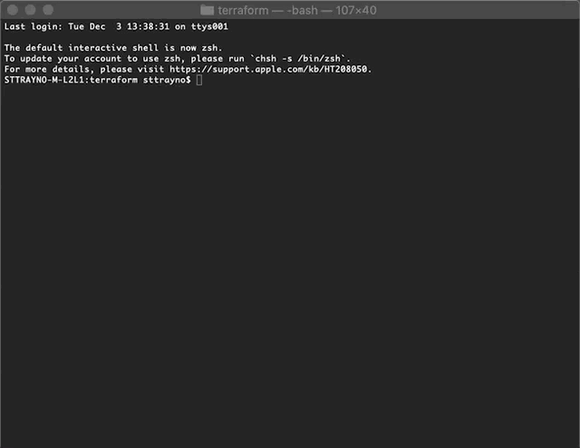

# Infrastructure as Code with Terraform - Crawl / Walk / Run

Terraform is an increasingly popular open-source infrastructure as code software tool built by HashiCorp. It enables administrators to define and provision manage infrastructure across multiple cloud and datacenter resources. Terraform takes an infrastructure as code approach by using using a high-level configuration language known as Hashicorp Configuration Language or JSON to define the resources. Terraform differs from traditional configuraiton management tools such as Ansible as its known for keeping state, once you define your desired state Terraform looks to build your infrastucture then recors its current state and always looks to maintain it's desired state

While Terraform has been increasingly used in the cloud space to provision infrastructure such as VMWare, AWS and Azure we're starting to see more and more usage of this with Cisco tools with support today for ASA firewalls and Cisco ACI in the data centre (Application Centric Infrastructure) within these exercises we'll look to focus on how Terraform can be used to configure ACI and provision resources.

## Exercise 0 - Installing Terraform

Terraform is supported across Windows, Linux/Unix and MacOS. The downloads for the latest version can be found from [here.](https://www.terraform.io/downloads.html)
Terraform is distributed as a single binary. Install Terraform by unzipping it and moving it to a directory included in your system's executable PATH. On Linux and MacOS systems you can do this through the command `$PATH` For more information on the install I'd recommend [This handy guide](https://www.vasos-koupparis.com/terraform-getting-started-install/)

To verify Terraform is installed use the command `Terraform` in your shell. Terraform should return a list of available commands.

To run these exercises you will need an instance of ACI running. dcloud.cisco.com has a couple of instances of ACI that you can reserve and use in this lab we'll be using the "Cisco ACI 4.1 Automation v1" demo which can be reserved and used. Alternatively you can also use your own instance of ACI if you have one available.

## Exercise 1 - Dipping our toe in the water, creating our first resources on ACI with Terraform

In this exercise we're going to look at an example terraform config file

First off in the file you'll notice that we define the username, password and url of the ACI instance in order that Terraform can authenticate. We can authenticate through using a private key or through username or password, storing credentials in plain text isn't recommended but we'll use it here so we can get up and running quickly. We'll cover other methods of authentication in later exercises.

>provider "aci" {
>  # cisco-aci user name
>  username = "admin"
>  # cisco-aci password
>  password = "C1sco12345"
>  # cisco-aci url
> url      = "https://198.18.133.200"
>  insecure = true
> }

